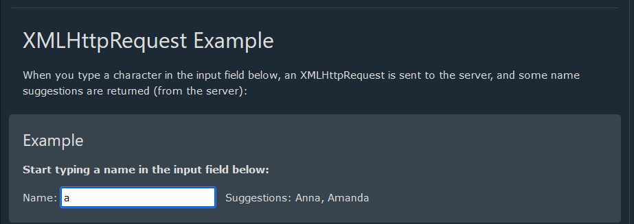

# XXE ( XML External Enitiy )

# **Summary of XML**

> HTML was designed to display data

> XML was designed to carry data - with focus on what data is

**XML its look like html in syntacs [ markup language ] designed to**

- store data
- carry data
- transport data
- self-descriptive

**The XML above is quite self-descriptive:**

- It has sender information
- It has receiver information
- It has a heading
- It has a message body

> In html we have a standard **Elements** like <h1> ,  , <form> , <a> , <p>

but :

> in XML we create a **Elements** name 🫥

So we can give a first example

if we need do a xml file to save a users data :

```xml
<?xml version="1.0" encoding="UTF-8"? >
<Users>

    <User>
        <UserID>1</UserID>
        <Name>alaa mersa</Name>
        <Email>mersa@example.com</Email>
        <Address> Cairo - Egypt</Address>
    </User>

    <User>
        <UserID>2</UserID>
        <Name>mahmoud</Name>
        <Email>mahmoud@example.com</Email>
        <Address>Jerusalem - Palestine</Address>
    </User>

</Users>

```

> As we see we can easily read the file and understand the content , but we have **additional** info :

**The Structure of the Elements**

```xml

<root>
  <child>
    <subchild>.....</subchild>
  </child>
</root>
```

- The terms parent, child, and sibling are used to describe the relationships between elements. Some Notes
- Parents have children. Children have parents and etc…
- Root **Elements** cannot duplicate
- subchild must written butween child **Elements**<child>subchild here</child>

```xml
<?xml version="1.0" encoding="UTF-8"? >
This line is called the XML prolog (prolog ~ مقدمه):
```

```xml
<message>salary < 1000</message>
//error
```

```xml
<message>salary &lt; 1000</message>
//true
```

There are 5 pre-defined entity references in XML:

| &lt;   | <   | less than      |
| ------ | --- | -------------- |
| &gt;   | >   | greater than   |
| &amp;  | &   | ampersand      |
| &apos; | '   | apostrophe     |
| &quot; | "   | quotation mark |

### **we can also added Attributes**

With **Elements Only :**

```xml
<person>
  <gender>female</gender>
  <firstname>Anna</firstname>
  <lastname>Smith</lastname>
</person>
```

With Elements and Attributes :

```xml
<person gender="female">
  <firstname>Anna</firstname>
  <lastname>Smith</lastname>
</person>
```

## **XML HttpRequest:**

**XML HttpRequest:** object can be used to request data from a web server :

- Update a web page without reloading the page
- Request data from a server - after the page has loaded
- Receive data from a server - after the page has loaded
- Send data to a server - in the background



## Sending an XMLHttpRequest

A common JavaScript syntax for using the XMLHttpRequest object looks much like this:

```jsx
var xhttp = new XMLHttpRequest();
xhttp.onreadystatechange = function () {
  if (this.readyState == 4 && this.status == 200) {
    // Typical action to be performed when the document is ready:
    document.getElementById("demo").innerHTML = xhttp.responseText;
  }
};
xhttp.open("GET", "filename", true);
xhttp.send();
```

> var xhttp = new XMLHttpRequest(); ⇒ The first line in the example above creates an **XMLHttpRequest** object.

> xhttp.onreadystatechange = function() ⇒ The **onreadystatechange** property specifies a function to be executed every time the status of the XMLHttpRequest object changes:

> if (this.readyState == 4 && this.status == 200) ⇒ When **readyState** property is 4 and the **status**
> property is 200, the response is ready:

> document.getElementById("demo").innerHTML = xhttp.responseText; ⇒ The **responseText** property returns the server response as a text string. The text string can be used to update a web page .

# **XML DTD**

- **DTD stands for Document Type Definition.**
- **A DTD defines the structure and the legal elements and attributes of an XML document.**

  ## Valid XML Documents

  A "Valid" XML document is "Well Formed", as well as it conforms to the rules of a
  DTD:

  ```jsx
  <?xml version="1.0" encoding="UTF-8"? >
   <!DOCTYPE note SYSTEM "Users.dtd">
  <Users>

      <User>
          <UserID>1</UserID>
          <Name>alaa mersa</Name>
          <Email>mersa@example.com</Email>
          <Address> Cairo - Egypt</Address>
      </User>

      <User>
          <UserID>2</UserID>
          <Name>mahmoud</Name>
          <Email>mahmoud@example.com</Email>
          <Address>Jerusalem - Palestine</Address>
      </User>

  </Users>

  ```

  ## Users.dtd

  ```
  <!DOCTYPE Users
  [
  <!ELEMENT Users (User+)>
  <!ELEMENT User (UserID, Name, Email, Address)>
  <!ELEMENT UserID (#PCDATA)>
  <!ELEMENT Name (#PCDATA)>
  <!ELEMENT Email (#PCDATA)>
  <!ELEMENT Address (#PCDATA)>
  ]>
  ```

  ### Explanation:

  - `<!ELEMENT Users (User+)>`: The `Users` element contains one or more `User` elements.
  - `<!ELEMENT User (UserID, Name, Email, Address)>`: The `User` element contains the `UserID`, `Name`, `Email`, and `Address` elements in that specific order.
  - `<!ELEMENT UserID (#PCDATA)>`: The `UserID` element contains parsed character data.
  - `<!ELEMENT Name (#PCDATA)>`: The `Name` element contains parsed character data.
  - `<!ELEMENT Email (#PCDATA)>`: The `Email` element contains parsed character data.
  - `<!ELEMENT Address (#PCDATA)>`: The `Address` element contains parsed character data.
    > #PCDATA means parseable character data.
